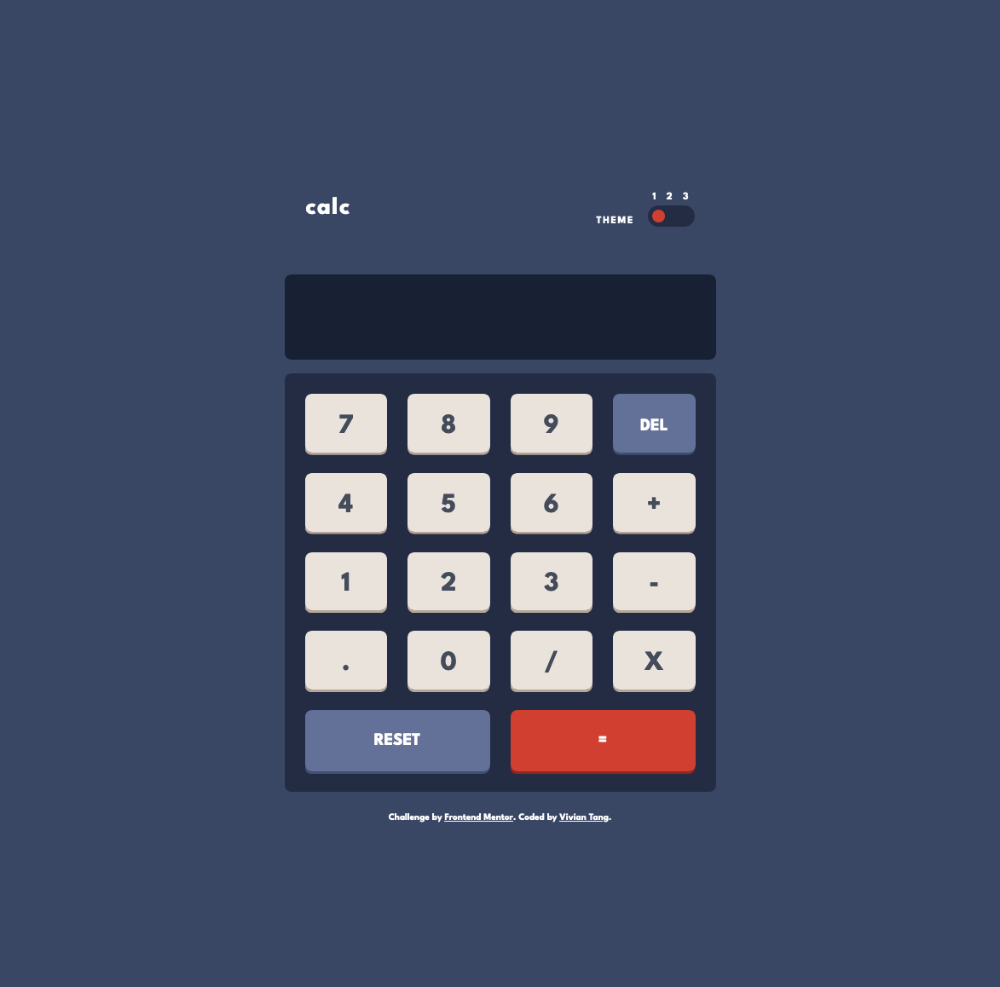
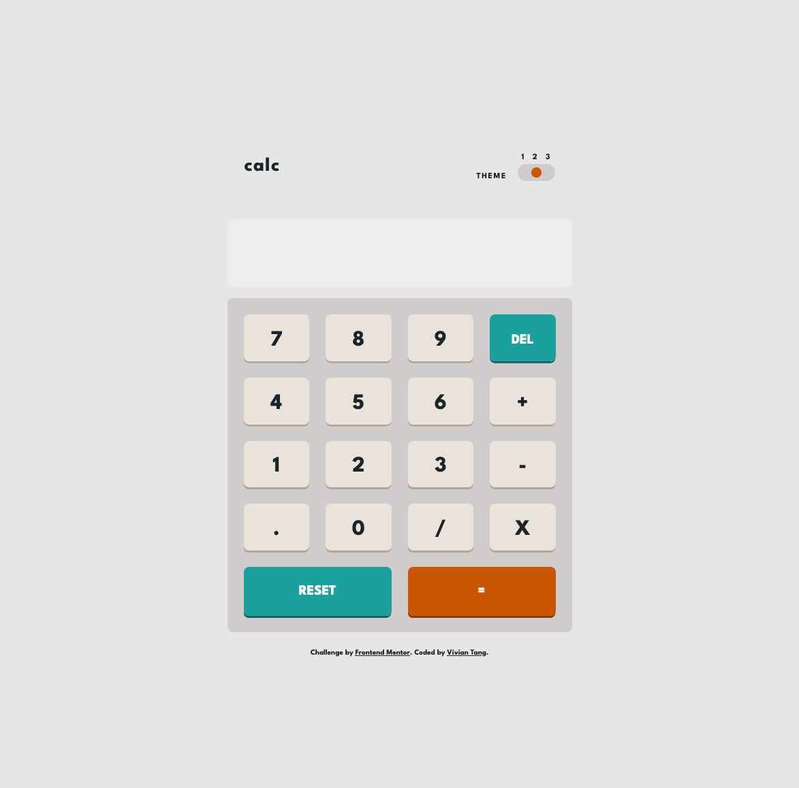
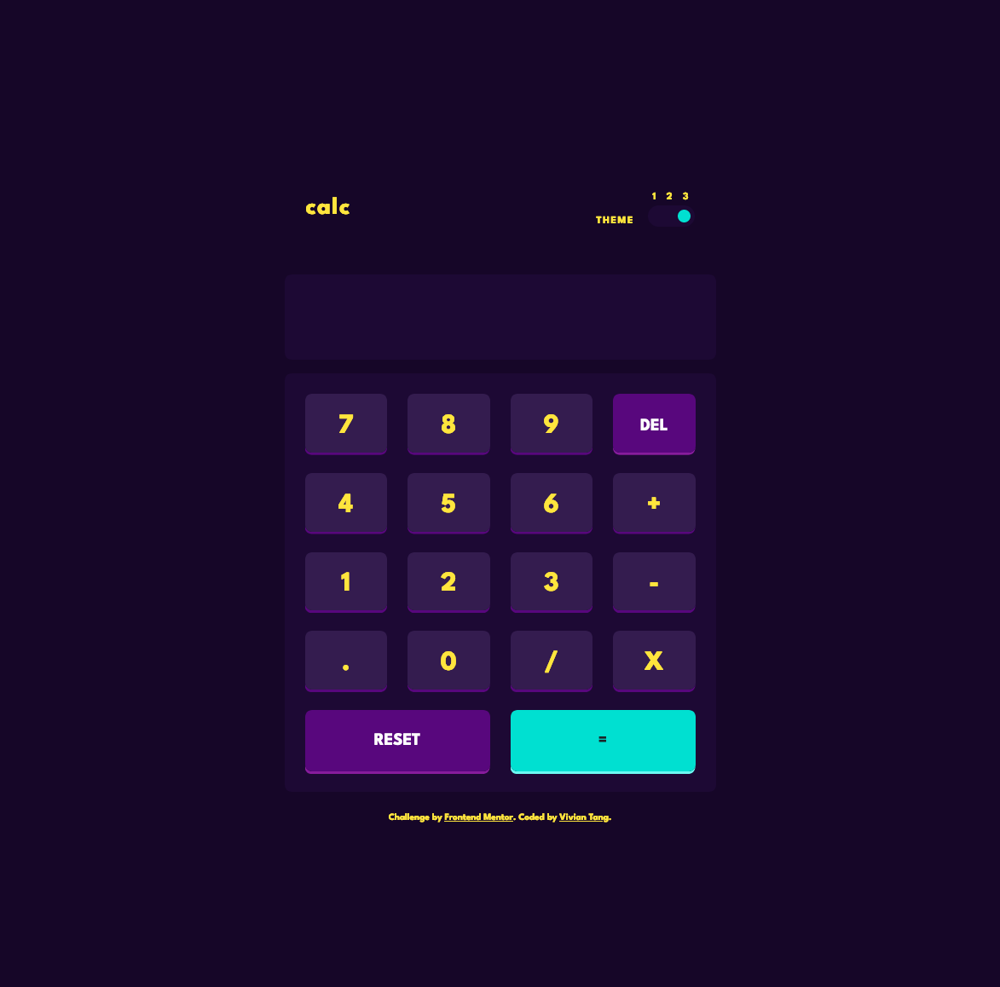

# Frontend Mentor - Calculator app

### The challenge

Users should be able to:

- See the size of the elements adjust based on their device's screen size
- Perform mathmatical operations like addition, subtraction, multiplication, and division
- Adjust the color theme based on their preference

### Screenshot

### Link

- Live Site URL: [https://github.com/jojo1242/calculator-app.git](https://github.com/jojo1242/calculator-app.git)

## My process

### Built with

- Semantic HTML5 markup
- Flexbox
- CSS Grid
- Mobile-first workflow
